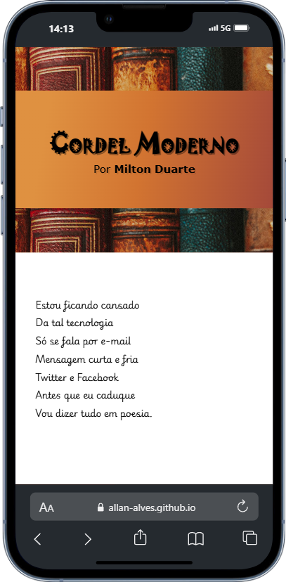
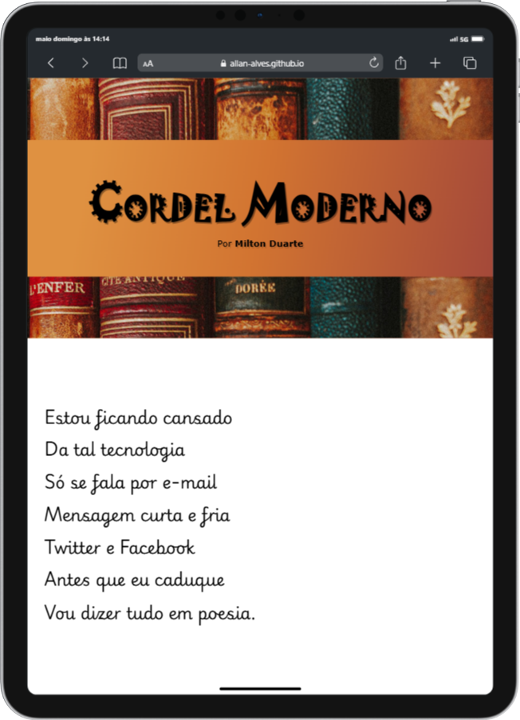
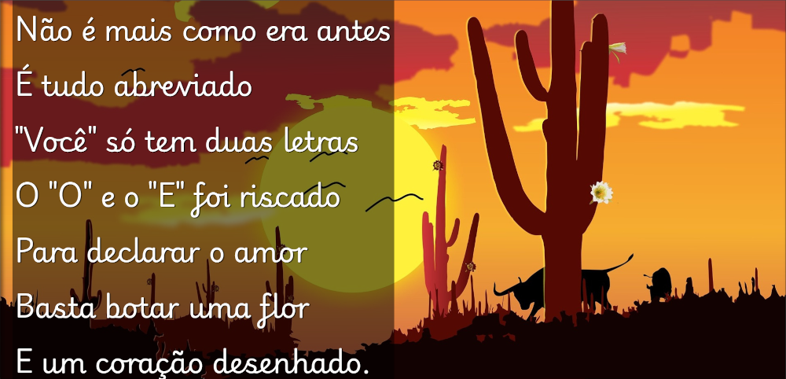

# Projeto Cordel Moderno
O projeto consiste em um site que apresenta de forma ilustrativa, com imagens que capturam a essência dos versos, um cordel do poeta brasileiro Milton Duarte. Projeto desenvolvido no curso de HTML5 e CSS3 do [Curso em Vídeo](https://www.cursoemvideo.com), com modificações realizadas por mim, aplicando os conhecimentos estudados e praticados ao longo do curso.

## Funcionalidades

* Responsividade do conteúdo
* Uso e aplicação da técnica parallax em imagens
* Inserção de fontes externas
* Uso de posicionamento de elementos
* Sombreamento de fontes
* Trabalho com técnica de degradê
* Aplicação e manipulação de imagens de fundo, utilizando os conceitos estudados e praticados referente á esse tópico

## Tecnologias utilizadas

* HTML5
* CSS3

## Acesso ao Projeto

[Acesse o site](https://allan-alves.github.io/Projeto-Cordel/)

## Demonstração em diferentes tamanhos de tela

__Mobile - iPhone 13 Pro - 390 x 844__

__Tablet - iPad Pro 11 - 834 x 1194__

__Desktop - 1920 x 1080__

